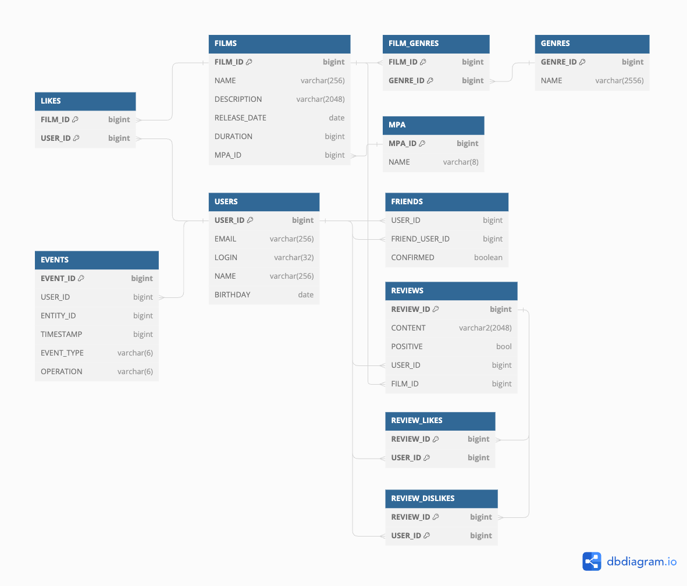

# java-filmorate
Template repository for Filmorate project.  
  
Проект будет состоять из 7 таблиц:
1. USERS - информация по пользователю, PK - USER_ID.  
    <br>
    Для получения инфо:  
    ```SELECT * FROM USERS WHERE USER_ID = {userId};```  
    <br>
   Для вставки пользователя:
    ```
    INSERT INTO USERS (EMAIL, LOGIN, NAME, BIRTHDAY)
   VALUES ({email}, {login}, {name}, {birthday}) 
   ```  
    <br>

2. FRIENDS - информация по списку друзей.  
    USER_ID и FRIEND_USER_ID являются FK для USERS(USER_ID).  
    Поле CONFIRMED сообщает: добавил ли другой пользователь, данного в друзья.  
    <br>
    Для получения списка друзей потребуется выполнить выборку:  
    ```SELECT FRIEND_USER_ID, CONFIRMED FROM FRIENDS WHERE USER_ID = {userId};```  
    <br>
    Добавить пользователя в друзья:
    ```
        IF EXISTS (SELECT USER_ID FROM FRIENDS  WHERE USER_ID = {friendId} AND FRIENDS_USER_ID = {userId})
            UPDATE FRIENDS SET CONFIRMED = TRUE  WHERE USER_ID = {friendId} AND FRIENDS_USER_ID = {userId};
            INSERT INTO FRIENDS (USER_ID, FRIEND_USER_ID, CONFIRMED) VALUES ({userId}, {friendId}, TRUE);
        ELSE
            INSERT INTO FRIENDS (USER_ID, FRIEND_USER_ID, CONFIRMED) VALUES ({userId}, {friendId}, FALSE);
        END IF;
    ```
3. FILMS - список фильмов, PK - FILM_ID, FK - MPA_ID.
   <br>
   Для получения инфо:  
   ```SELECT * FROM FILMS WHERE FILM_ID = {filmId};```  
   <br>
   Для вставки фильма:
    ```
   INSERT INTO FILMS (NAME, DESCRIPTION, RELEASE_DATE, DURATION, MPA_ID)
   VALUES ({name}, {desc}, {releasDate}, {duration}, {mpaId}) 
   ```  
    <br>
4. LIKES - список лайков фильма. FK - FILM_ID, USER_ID.  
    <br>
    Получить список лайков:  
    ```SELECT USER_ID FROM LIKES WHERE FILM_ID = {filmID}```  
    Добавить лайк:  
   ```INSERT INTO LIKES (FILM_ID, USER_ID) VALUES ({filmId}, {userId})```  
    <br>
5. MPA - справочник ретинга фильма. PK - MPA_ID.  
    Справочник заполнить сразу, и назначать фильму id.  
    <br>
    Получить значение:  
   ```SELECT NAME FROM MPA WHERE MPA_ID = {mpaId}```
6. FILM_GENRES - Талица для связи "многие ко многим", чтобы привязывать одному фильму несколько жанров. FK - FILM_ID, 
   GENRE_ID.  
    <br>
    Получить список id жанров фильма:  
   ```SELECT GENRE_ID FROM FILM_GENRES WHERE FILM_ID = {filmId}```
    <br>  
    Добавить жанр к фильму:  
   ```INSERT INTO FILM_GENRES VALUES ({filmId}, {genreId})```
7. GENRES - справочник жанров фильма. Наполнить сразу. PK - GENRE_ID.  
    У каждого жанра, будет свой id.  
    <br>
   Получить названия жанра:  
   ```SELECT NAME FROM GENRES WHERE GENRE_ID = {genreId}```
    
